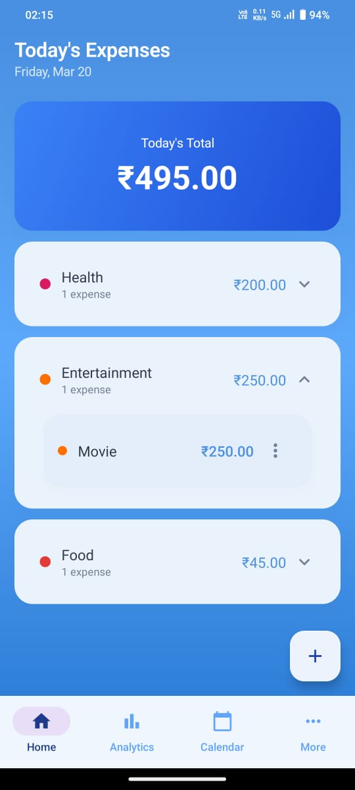
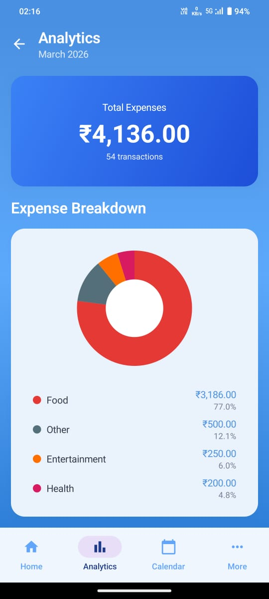
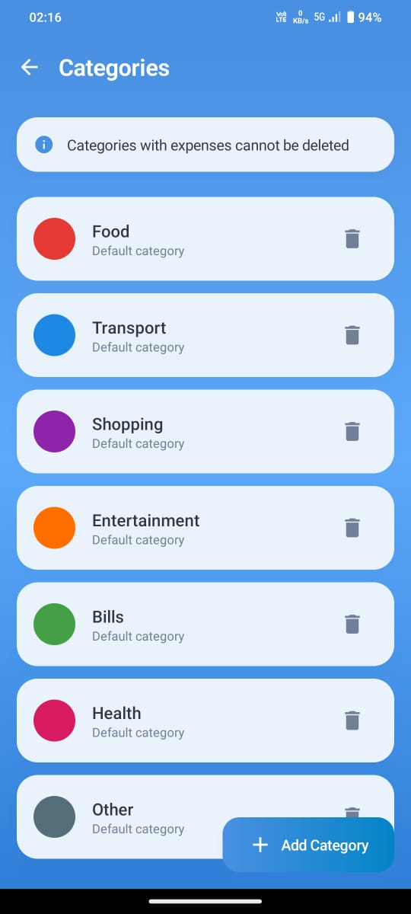
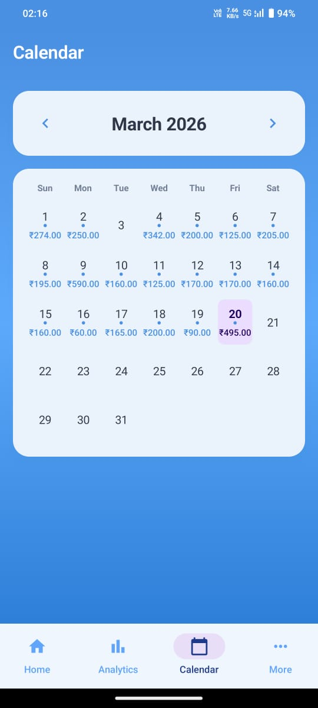

# Splendid - Personal Finance Tracker

<p align="center">
  
  
  
  
</p>

---

## Overview

**Splendid** is a modern, offline-first Android application designed to simplify personal finance. Whether you want to track daily expenses, manage monthly budgets, or keep tabs on IOUs, Splendid provides a clean and intuitive interface to stay on top of your money.

> [!NOTE]
> This app is privacy-focused. All your financial data stays on your device—no internet connection or cloud sync required.

---

## Screenshots

| Home Screen | Analytics | Budget Settings |
| :---: | :---: | :---: |
|  |  |  |

| IOU Management | Categories | Calendar |
| :---: | :---: | :---: |
|  |  |  |

---

## Key Features

### Smart Expense Tracking
- **Autocomplete Suggestions:** Quickly add expenses with titles suggested based on your past habits.
- **Quantity Support:** Effortlessly manage items bought in bulk.
- **Categorization:** Organize spending with custom-colored categories (7 defaults included).

### Powerful Analytics
- **Visual Insights:** Weekly and monthly spending charts to identify trends.
- **Title Grouping:** "Coffee" and "coffee" are grouped together for accurate reports.
- **Breakdown:** See exactly where your money goes with a detailed category breakdown.

### Calendar Overview
- **Visual History:** Quickly see which days you spent money on at a glance.
- **Quick Navigation:** Jump to any day's transactions instantly.

### IOU Management
- **Lent & Borrowed:** Separate tracking for money you owe and money owed to you.
- **Debt Balance:** Real-time calculation of your net IOU balance.

###  Budget Control
- **Limit Setting:** Set monthly limits for total spending.
- **Real-time Alerts:** Get notified when you're approaching or exceeding your budget.

---

##  Tech Stack

- **Core:** [Kotlin](https://kotlinlang.org/)
- **UI Architecture:** [MVVM](https://en.wikipedia.org/wiki/Model%E2%80%93view%E2%80%93viewmodel) with [Clean Architecture](https://blog.cleancoder.com/uncle-bob/2012/08/13/the-clean-architecture.html)
- **Frameworks:** [Jetpack Compose](https://developer.android.com/jetpack/compose) for a modern declarative UI.
- **Dependency Management:** [Koin](https://insert-koin.io/) (or Hilt, if used)
- **Asynchronous:** [Kotlin Coroutines](https://kotlinlang.org/docs/coroutines-overview.html) & [Flow](https://kotlinlang.org/docs/flow.html)
- **Local Persistence:** [Room Database](https://developer.android.com/training/data-storage/room)
- **Preferences:** [Jetpack DataStore](https://developer.android.com/topic/libraries/architecture/datastore)

---

## Getting Started

### Prerequisites
- Android Studio Hedgehog (2023.1.1) or later
- JDK 17
- Android SDK API 26+

### Local Setup
1. **Clone the repository:**
   ```bash
   git clone https://github.com/Saipramodh033/Splendid.git
   ```
2. **Open in Android Studio:**
   - File → Open → Select the `Splendid` project folder.
3. **Sync and Build:**
   - Wait for Gradle sync to complete.
   - Run the app on an emulator or a physical device.

---

##  Contributing

Contributions are welcome! If you find a bug or have a feature suggestion, feel free to open an issue or submit a pull request.

<p align="center">Made with  for better financial habits.</p>
